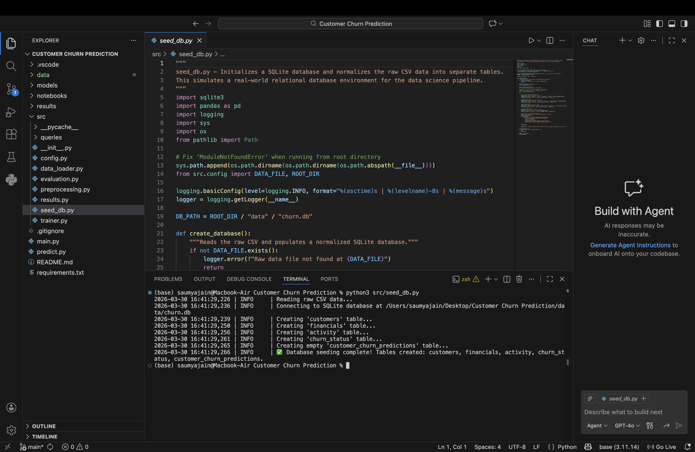
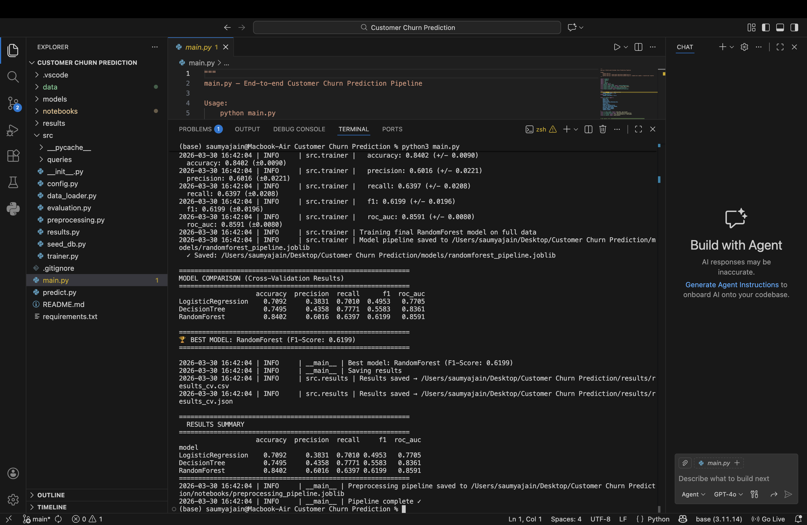

<div align="center">
  <h1>🏦 Customer Churn Prediction: An End-to-End Data Pipeline</h1>
  <p>A complete Machine Learning and Data Engineering pipeline predicting customer churn using PostgreSQL/SQLite, advanced SQL Feature Engineering, and ensemble ML models.</p>
</div>

<br>

### 1. Database Engineering & Transformation


### 2. Machine Learning Training & Model Selection


<br>

---

## 🏗 Architecture & SQL Data Pipeline

To simulate an authentic enterprise environment, this project does not simply load data from a static CSV. Instead, it utilizes an end-to-end data pipeline:

1. **Relational Database Seeding**: Raw data is ingested and normalized into a standard local SQLite/PostgreSQL database containing 4 distinct tables: `customers`, `financials`, `activity`, and `churn_status`.
2. **SQL Feature Extraction**: Features are engineered dynamically at the database level using pure SQL. This demonstrates the ability to push computation to the data warehouse using:
   - **CTEs (Common Table Expressions)** for modular query design.
   - **Multi-Table JOINs** to consolidate normalized entities.
   - **Window Functions** (e.g., `RANK() OVER`) to engineer relative demographic insights.
   - **Conditional Aggregations** to build binary activity flags.
3. **Python ORM / Loader**: Using `pandas.read_sql()`, the resulting feature space is fetched securely via `sqlite3` for training, minimizing Python memory overhead.
4. **Prediction Write-Back**: All batch inferences and probabilities generated by the ML model are written back to a `customer_churn_predictions` table in the database to be consumed by downstream BI dashboards.

---

## 💻 Tech Stack
- **Languages**: Python, SQL
- **Data Engineering**: SQLite3, Pandas (ETL & Querying)
- **Machine Learning**: Scikit-Learn, XGBoost, Random Forest, Logistic Regression
- **Evaluation**: Accuracy, Precision, Recall, F1-Score, ROC-AUC

---

## 📊 Business Analytics & Supporting Queries

A critical part of taking a model to production is understanding the business context. Inside `src/queries/analysis.sql`, you will find advanced queries designed to answer immediate business questions, such as:

- **Customer Distribution** *(Geography GROUP BYs)*
- **Churn Rate by Regional Segments** *(Multi-table JOINs)*
- **High-Risk Zero-Balance Customer Identification** *(WHERE filtering)*
- **Global Wealth Ranking** *(Window Functions: `RANK() OVER (ORDER BY Balance DESC)`)*
- **Tenure Analysis** *(Aggregations to see if account age impacts churn)*

---

## 🚀 Quick Start

Want to run this pipeline yourself?

### 1. Install Dependencies
```bash
pip install -r requirements.txt
```

### 2. Build the Database Data Warehouse
*Reads the raw CSV and constructs the normalized relational database.*
```bash
python src/seed_db.py
```

### 3. Run the ML Pipeline
*Extracts features via SQL, applies preprocessing, trains 4 models with cross-validation, and saves the best pipeline.*
```bash
python main.py
```

### 4. Make Batch Predictions
*Loads new data, predicts churn likelihood, and writes decisions back to the SQLite Database.*
```bash
python predict.py --model models/randomforest_pipeline.joblib --data data/Churn_Modelling.csv
```

---

## 📂 Project Structure

```
.
├── data/
│   ├── Churn_Modelling.csv          ← Initial raw data
│   └── churn.db                     ← Generated normalized SQLite database
├── models/                           ← Saved trained models (.joblib)
├── results/                          ← Performance metrics (CV results)
├── src/
│   ├── queries/
│   │   ├── feature_engineering.sql  ← Advanced SQL extraction & CTEs
│   │   └── analysis.sql             ← Business impact & demographic queries
│   ├── config.py                    ← Configuration & hyperparameters
│   ├── seed_db.py                   ← Generates database & tables
│   ├── data_loader.py               ← Connects to SQLite & fetches data via SQL
│   ├── preprocessing.py             ← Data preprocessing pipeline
│   ├── trainer.py                   ← Train & save models
│   ├── evaluation.py                ← Calculate metrics & ROC curves
│   └── results.py                   ← Save results
├── main.py                          ← Run the full pipeline
├── predict.py                       ← Make predictions & write to DB
└── requirements.txt                 ← Python packages
```

SAUMYA JAIN
